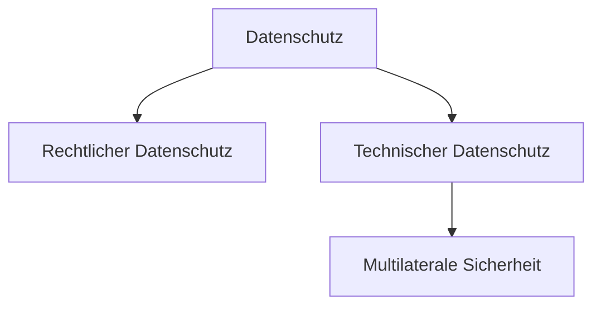

# [Datenschutz](https://de.wikipedia.org/wiki/Datenschutz)

<!-- toc -->

## Geschichte

> **💬** Warum ist Datenschutz für Individuen und Gemeinwohl wichtig?

> [Hippokratischer Eid](https://de.wikipedia.org/wiki/Eid_des_Hippokrates) (Antike):
>
> „Was ich bei der Behandlung sehe oder höre oder auch außerhalb der Behandlung im Leben der Menschen, werde ich, soweit man es nicht ausplaudern darf, verschweigen und solches als ein Geheimnis betrachten.“

> * 1949 Grundgesetz
>   * [Artikel 1 (1)](https://www.gesetze-im-internet.de/gg/art_1.html) „**Die Würde des Menschen ist unantastbar.** Sie zu achten und zu schützen ist Verpflichtung aller staatlichen Gewalt.“
>   * [Artikel 2 (1)](https://www.gesetze-im-internet.de/gg/art_2.html) „**Jeder hat das Recht auf die freie Entfaltung seiner Persönlichkeit**, soweit er nicht die Rechte anderer verletzt und nicht gegen die verfassungsmäßige Ordnung oder das Sittengesetz verstößt.“
>   * [Artikel 10 (1)](https://www.gesetze-im-internet.de/gg/art_10.html) „Das **Briefgeheimnis sowie das Post- und Fernmeldegeheimnis** sind unverletzlich.“

> * 1950 Europäische Menschenrechtskonvention
>   * [Artikel 8 (1)](https://de.wikipedia.org/wiki/Europ%C3%A4ische_Menschenrechtskonvention#Artikel_8_%E2%80%93_Recht_auf_Achtung_des_Privat-_und_Familienlebens) „Jede Person hat das Recht auf Achtung ihres Privat- und Familienlebens, ihrer Wohnung und ihrer Korrespondenz.“

> * 1970 weltweit erstes Datenschutzgesetz (in [Hessen](https://de.wikipedia.org/wiki/Hessisches_Datenschutzgesetz))
> * 1977 **Bundesdatenschutzgesetz**

> * 1983 [Volkszählungsurteil](https://de.wikipedia.org/wiki/Volksz%C3%A4hlungsurteil) => „[Recht auf informationelle Selbstbestimmung](https://de.wikipedia.org/wiki/Informationelle_Selbstbestimmung)“
>   * „Mit dem Recht auf informationelle Selbstbestimmung wären eine Gesellschaftsordnung und eine diese ermöglichende Rechtsordnung nicht vereinbar, in der Bürger nicht mehr wissen können, wer was wann und bei welcher Gelegenheit über sie weiß. **Wer unsicher ist, ob abweichende Verhaltensweisen jederzeit notiert und als Information dauerhaft gespeichert, verwendet oder weitergegeben werden, wird versuchen, nicht durch solche Verhaltensweisen aufzufallen. […] Dies würde nicht nur die individuellen Entfaltungschancen des Einzelnen beeinträchtigen, sondern auch das Gemeinwohl**, weil Selbstbestimmung eine elementare Funktionsbedingung eines auf Handlungsfähigkeit und Mitwirkungsfähigkeit seiner Bürger begründeten freiheitlichen demokratischen Gemeinwesens ist. Hieraus folgt: **Freie Entfaltung der Persönlichkeit setzt unter den modernen Bedingungen der Datenverarbeitung den Schutz des Einzelnen gegen unbegrenzte Erhebung, Speicherung, Verwendung und Weitergabe seiner persönlichen Daten voraus.**“

> * 2008 Bundesverfassungsgerichtsurteil zur [Online-Durchsuchung (Bundestrojaner)](https://de.wikipedia.org/wiki/Online-Durchsuchung_in_Deutschland#Bundesverfassungsgericht)
> => „[**Grundrecht auf Gewährleistung der Vertraulichkeit und Integrität informationstechnischer Systeme**](https://de.wikipedia.org/wiki/Grundrecht_auf_Gew%C3%A4hrleistung_der_Vertraulichkeit_und_Integrit%C3%A4t_informationstechnischer_Systeme)“ (Grundrecht auf digitale Intimsphäre)

> * 2009 [Charta der Grundrechte der Europäischen Union](https://de.wikipedia.org/wiki/Charta_der_Grundrechte_der_Europ%C3%A4ischen_Union)
>   * [Artikel 8 (1)](https://dejure.org/gesetze/GRCh/8.html) „**Jede Person hat das Recht auf Schutz der sie betreffenden personenbezogenen Daten**.“
>   * [Artikel 8 (2)](https://dejure.org/gesetze/GRCh/8.html) „Diese Daten dürfen nur nach Treu und Glauben **für festgelegte Zwecke und mit Einwilligung der betroffenen Person oder auf einer sonstigen gesetzlich geregelten legitimen Grundlage** verarbeitet werden. Jede Person hat das **Recht, Auskunft über die sie betreffenden erhobenen Daten zu erhalten und die Berichtigung der Daten zu erwirken**.“

> * 2018 [**Datenschutz-Grundverordnung**](https://de.wikipedia.org/wiki/Datenschutz-Grundverordnung)

> **💡** [Podcast Datenschutzgeschichte](https://www.datenschutzzentrum.de/interviews/)

> * 2024 [**Cyber Resilience Act**](https://de.wikipedia.org/wiki/Cyberresilienz-Verordnung) (CRA)
>
>   * gilt ab dem **11.12.2027**

## Gesetzliche Bestimmungen

> **❓❗** Welche Datenschutzgesetze gelten in Deutschland?

### [Datenschutz-Grundverordnung](https://de.wikipedia.org/wiki/Datenschutz-Grundverordnung) (DSGVO)

=> hat Anwendungsvorrang vor dem BDSG

=> gilt im [Europäischen Wirtschaftsraum](https://de.wikipedia.org/wiki/Europ%C3%A4ischer_Wirtschaftsraum)

### [Bundesdatenschutzgesetz](https://de.wikipedia.org/wiki/Bundesdatenschutzgesetz) (BDSG)

=> ergänzt und präzisiert die DSGVO

### weitere Gesetze
#### Landesdatenschutzgesetze
#### [IT-Sicherheitsgesetz](https://www.bsi.bund.de/DE/Das-BSI/Auftrag/Gesetze-und-Verordnungen/IT-SiG/2-0/it_sig-2-0_node.html) (IT-SIG)
#### [BSI-Gesetz](https://www.bsi.bund.de/DE/Das-BSI/Auftrag/Gesetze-und-Verordnungen/BSI-Gesetz/bsi-gesetz_node.html) (BSIG)
#### [Telekommunikationsgesetz](https://de.wikipedia.org/wiki/Telekommunikationsgesetz_(Deutschland)) (TKG)
#### [Digitale-Dienste-Gesetz](https://de.wikipedia.org/wiki/Digitale-Dienste-Gesetz) (DDG)
=> ersetzt das [Telemediengesetz](https://de.wikipedia.org/wiki/Telemediengesetz) (TMG)
#### [Cyber Resilience Act](https://de.wikipedia.org/wiki/Cyberresilienz-Verordnung) (CRA)

## Umsetzung

