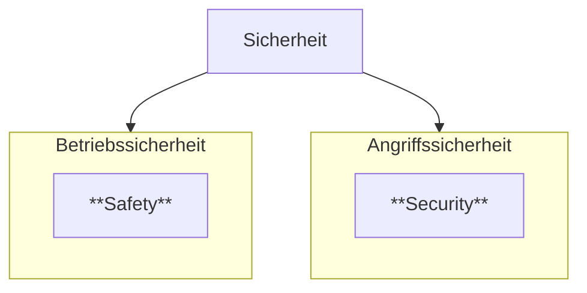
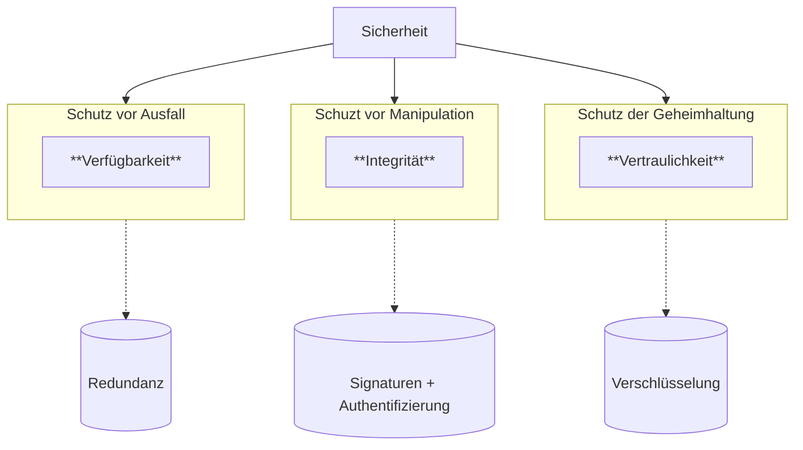
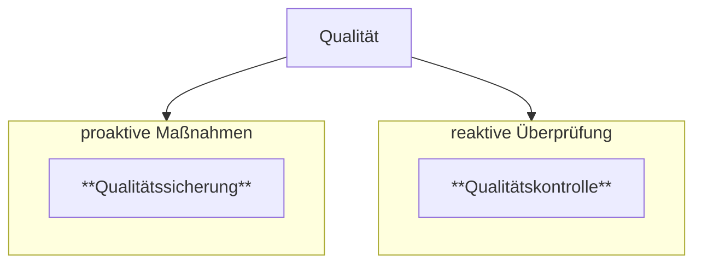

# Datensicherheit
(IT-Sicherheit / Cyber-Security)

<!-- toc -->

## Safety vs. Security

## „Schutzziele“ / „Hauptziele“ / „Grundwerte“

## Relative Sicherheit

> „**Sicherheit ist stets relativ** – absolute Sicherheit gibt es ebenso wenig wie absolute Freiheit oder absolute Unabhängigkeit.
>
> Unsicherheit hingegen kann sich viel stärker der Absolutheit nähern als Sicherheit.“

## „Stand der Technik“
=> entwickelt sich mit der Fortschritt der Technologie weiter

=> Einsatz von modenen und effektiven Sicherheitsmaßnahmen nötig

=> [**kontinuierlicher Verbesserungsprozess**](https://de.wikipedia.org/wiki/Kontinuierlicher_Verbesserungsprozess) (KVP)

=> [plan–do–check–act (**PDCA**) ](https://de.wikipedia.org/wiki/Demingkreis)

> **💡** aktuelle Empfehlungen des BSI:
>
> [BSI TR-02102](https://www.bsi.bund.de/DE/Themen/Unternehmen-und-Organisationen/Standards-und-Zertifizierung/Technische-Richtlinien/TR-nach-Thema-sortiert/tr02102/tr02102_node.html) „Kryptographische Verfahren: Empfehlungen und Schlüssellängen“

## Compliance und Qualität

Sicherheit erfordert [**Compliance**](https://de.wikipedia.org/wiki/Compliance_(Recht)) (einhalten von Regeln) und [**Qualität**](https://de.wikipedia.org/wiki/Qualit%C3%A4tsmanagement#Regelkreis_des_Qualit%C3%A4tsmanagements)

## Berechnung des Nutzens von Sicherheit
ErwartetungswertSchaden = ∑ WahrscheinlichkeitSchadenseintritt * SchadenshöheSchadensfall
