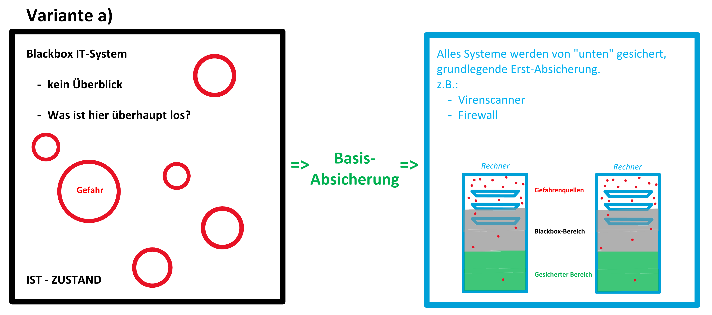
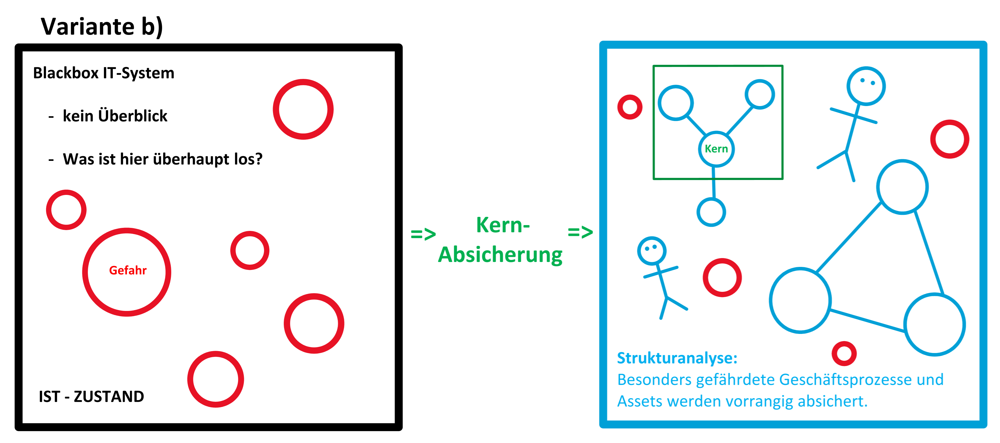
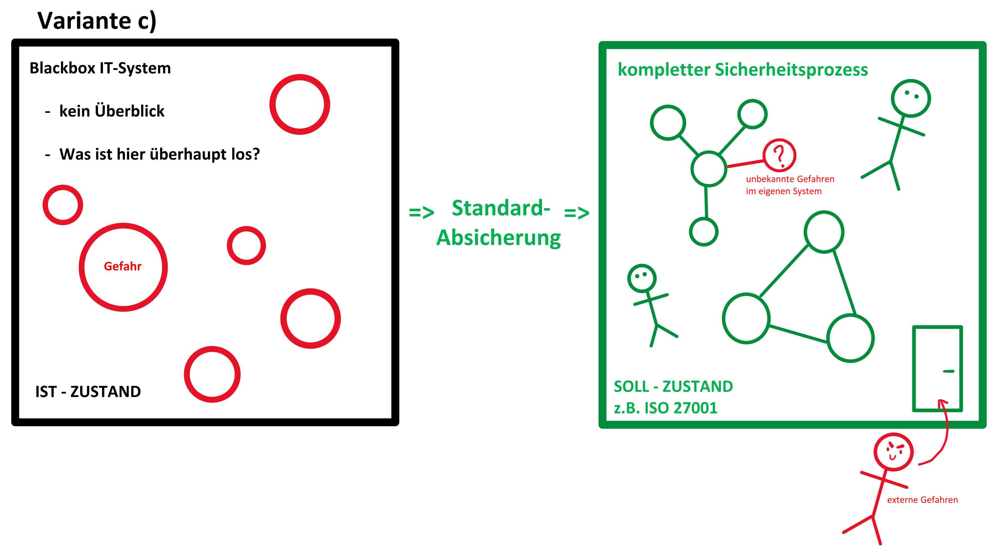

# [BSI IT-Grundschutz](https://de.wikipedia.org/wiki/IT-Grundschutz)
=> vom Bundesamt für Sicherheit in der Informationstechnik (BSI) entwickelte, frei verfügbare Vorgehensweise um ein Informationssicherheits-Managementsystem umzusetzen

<!-- toc -->

## IT-Grundschutz-Methodik
(nach [BSI-Standard 200-2](https://www.bsi.bund.de/DE/Themen/Unternehmen-und-Organisationen/Standards-und-Zertifizierung/IT-Grundschutz/BSI-Standards/BSI-Standard-200-2-IT-Grundschutz-Methodik/bsi-standard-200-2-it-grundschutz-methodik_node.html))

Die IT-Grundschutz-Methodik etabliert drei Vorgehensweisen um um ein ISMS umzusetzen:

### Basis-Absicherung
=> vereinfachter Einstieg (grundlegende Erst-Absicherung)

### Kern-Absicherung
=> Einstieg, der besonders gefährdete Geschäftsprozesse und Assets vorrangig absichert

### Standard-Absicherung
=> **kompletter** Sicherheitsprozess, der als [Grundlage für Zertifizierung](https://de.wikipedia.org/wiki/IT-Grundschutz#ISO_27001-Zertifikat_auf_der_Basis_von_IT-Grundschutz) nach ISO 27001 dienen kann

## BSI-Standards

### *BSI-Standard 200-1*: [Managementsysteme für Informationssicherheit (ISMS)](https://www.bsi.bund.de/SharedDocs/Downloads/DE/BSI/Grundschutz/BSI_Standards/standard_200_1.html)
* orientiert sich an ISO 27001
* enthällt u.A. Empfehlungen für:
  * **Erstellung** des Sicherheitskonzepts
  * **Umsetzung** des Sicherheitskonzepts
  * **Erfolgskontrolle** des Sicherheitskonzepts
  * **Kontinuierliche Verbesserung** des Sicherheitskonzepts

### *BSI-Standard 200-2*: [IT-Grundschutz-Methodik](https://www.bsi.bund.de/SharedDocs/Downloads/DE/BSI/Grundschutz/BSI_Standards/standard_200_2.html)
* methodische Hilfestellungen zur schrittweisen Einführung eines ISMS
* effiziente Verfahren
* konkretisiert allgemeine Anforderungen aus BSI-Standard 200-1
* enthällt u.A. Empfehlungen für:
  * **Basis**-Absicherung
    * breite, grundlegende Erst-Absicherung
  * **Kern**-Absicherung
    * besonders gefährdete Geschäftsprozesse und Assets vorrangig absichern
  * **Standard**-Absicherung
    * umfassende, tiefgehende Abgesicherung (klassischen IT-Grundschutz-Vorgehensweise)
  * Verantwortlicheiten, z.B.
    * Informationssicherheitsbeauftragte
    * Datenschutzbeauftragte
    * Geschäftsführung/Management
    * externe Sicherheitsexperten
  * **ISO 27001 Zertifizierung**

> „Die umfangreichen Informationen rund um IT-Grundschutz ersetzen nicht den **gesunden Menschenverstand**.  
> Informationssicherheit zu **verstehen, umzusetzen und zu leben, sollte Priorität haben**.  
> Das IT-Grundschutz-Kompendium bietet zu vielen Aspekten eine Menge an Informationen und Empfehlungen.  
> Bei deren Bearbeitung sollte immer im Auge behalten werden, dass aus diesen die für die jeweilige Institution und ihre Rahmenbedingungen geeigneten Sicherheitsanforderungen ausgewählt und angepasst werden. […]  
> Weder die Anforderungen der Bausteine des IT-Grundschutz-Kompendiums noch die Maßnahmen der Umsetzungshinweise sollten als pure Checklisten zur Statusfeststellung genutzt werden, sondern **mit Augenmaß an die individuellen Bedingungen angepasst** werden.“  
> *\[[BSI-Standard 200-2: IT-Grundschutz-Methodik](https://www.bsi.bund.de/SharedDocs/Downloads/DE/BSI/Grundschutz/BSI_Standards/standard_200_2.html)\]*

### *BSI-Standard 200-3*: [Risikoanalyse auf der Basis von IT-Grundschutz](https://www.bsi.bund.de/SharedDocs/Downloads/DE/BSI/Grundschutz/BSI_Standards/standard_200_3.html)
* vereinfachtes Verfahren zur Risikoanalyse
  * zielgerichtet, „leicht“ anzuwenden, anerkannt
* hilfreich, wenn Komponenten abzusichern sind, bei denen fraglich ist, ob die Erfüllung von Basis- und Standard-Anforderungen für eine ausreichende Sicherheit genügt
* enthällt u.A. Empfehlungen für:
  * Erstellung einer Gefährdungsübersicht
  * Risikoeinstufung
  * Behandlung von Risiken
  * Konsolidierung des Sicherheitskonzepts 
