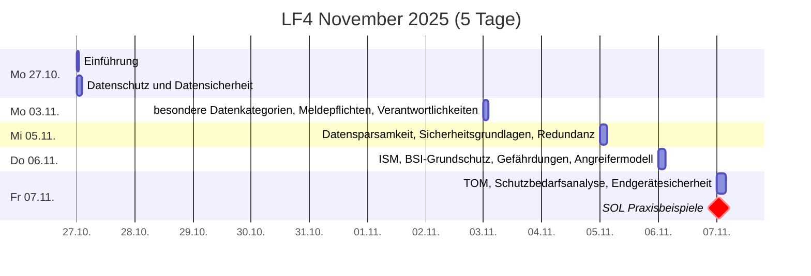
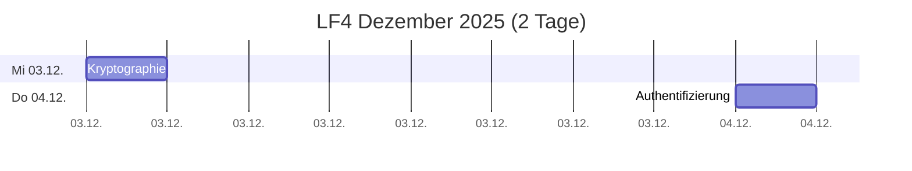
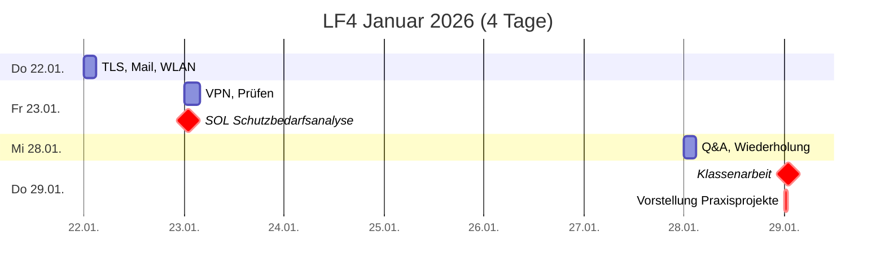
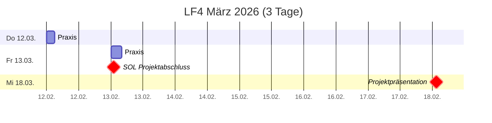

# Plan
40UE -> 1 doppelte + 3 einfache Noten

## Zeitplan

## Leistungsnachweise
* **Klassenarbeit** (doppelte Wertung, 90min, handschriftlich)
  * erlaubte Hilfsmittel: Fact sheet (1 A4-Blatt, einseitig beschrieben)
  * Themen: Alles was im Unterricht bis dahin behandelt wurde…
  * Schwerpunkte (bisher vermittelter Inhalte — wird schrittweise ergänzt):
    * [Datenschutz & Datensicherheit](./dud.md): Begriffsunterscheidung
      * [Datenschutz](./datenschutz.md): relevante Gesetze
      * [Prinzipien](./datenschutz_prinzipien.md): Verbot mit Erlaubnisvorbehalt, Grundsätze für die Verarbeitung, Betroffenenrechte, besonderer Kategorien personenbezogener Daten, Melde-/Benachrichtigungspflichte
      * [Datensparsamkeit](./datensparsamkeit.md): Privacy by Default, Privacy by Design, Anonymität, Pseudonymität
      * [Datensicherheit](./datensicherheit.md): Safety vs. Security, Schutzziele / Hauptziele / Grundwerte, Relative Sicherheit, „Stand der Technik“, Qualität
        * [Sicherheitsmanagement](./ism.md): ISO 27001, IT-Grundschutz-Methodik
          * [Notfallmanagement](./notfallmanagement.md)
    * [Gefährdungen](./gefährungen.md): Malware, Ransomware, Würmer, Trojaner, Phishing, Spear-Phishing, DoS, DDoS

    * Datenverarbeitungsprozesse: [Menschen- und Maschinenlesbaren Datenformate](./oer.md)
    * [EMail](./mail.md): TO/CC/BCC, Mailinglisten, FROM, Verschlüsselung

     <!--
     * [Informatik und Gesellschaft](./iug.md)
     -->

* **Schutzbedarfs- und Risikoanalyse** (einfache Wertung)

* Projektpräsentation
  * **fachliche Leistung** (einfache Wertung)
  * **Mitarbeit** (einfache Wertung)
