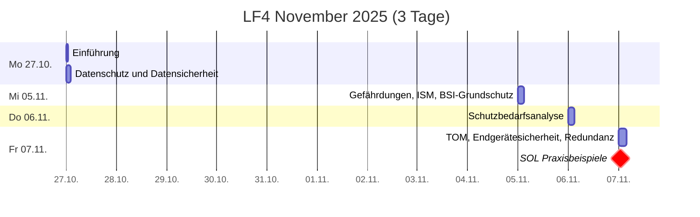

# Plan
40UE -> 1 doppelte + 3 einfache Noten

## Zeitplan

## Leistungsnachweise
* **Klassenarbeit** (doppelte Wertung, 90min, handschriftlich)
  * erlaubte Hilfsmittel: Fact sheet (1 A4-Blatt, einseitig beschrieben)
  * Themen: Alles was im Unterricht bis dahin behandelt wurde…
  * Schwerpunkte (bisher vermittelter Inhalte — wird schrittweise ergänzt):
    * [Datenschutz & Datensicherheit](./dud.md) (Begriffsunterscheidung)
     * [Datenschutz](./datenschutz.md) (relevante Gesetze)
     * [Prinzipien](./datenschutz_prinzipien.md) (Verbot mit Erlaubnisvorbehalt, Grundsätze für die Verarbeitung, Betroffenenrechte)

* **Schutzbedarfs- und Risikoanalyse** (einfache Wertung)

* Projektpräsentation
  * **fachliche Leistung** (einfache Wertung)
  * **Mitarbeit** (einfache Wertung)
