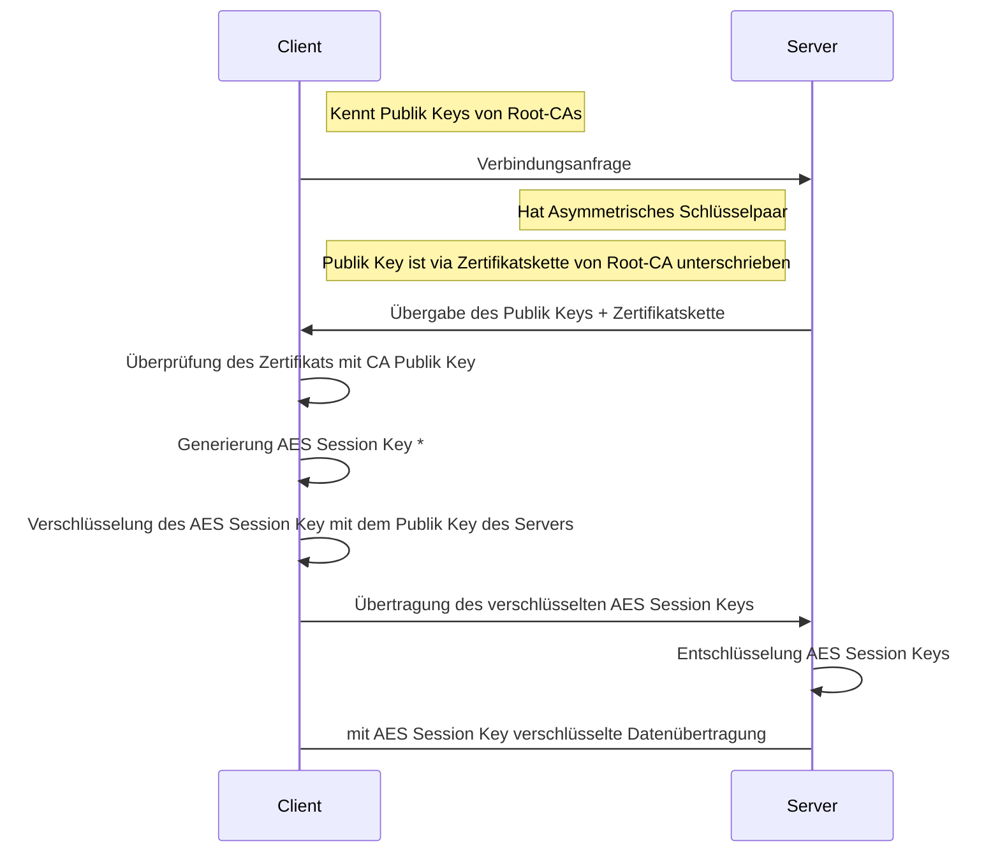

# [SSL/TLS](https://de.wikipedia.org/wiki/Transport_Layer_Security)

> **❓❗** Was ist TLS und wie funktioniert es?

> **❓❗** Wie wird der Session Key für eine TLS-Verbindung generiert?

> `*` bzw. [Diffie-Hellman-Schlüsselaustausch](https://de.wikipedia.org/wiki/Transport_Layer_Security#TLS_Handshake_Protocol)

<!--
> IHK-Prüfung Winter 2021/22
>
> IKH-Prüfung IDS HTTPS-Entschlüsselung
-->

> **❓💬** Was muss beim Einsatz von TLS beachtet werden?

> **💡** **BSI-Empfehlungen für den Einsatz von TLS**:
>
> TR-02102-2 „Kryptographische Verfahren: Empfehlungen und Schlüssellängen“
> [Teil 2 – Verwendung von Transport Layer Security (TLS)](https://www.bsi.bund.de/SharedDocs/Downloads/DE/BSI/Publikationen/TechnischeRichtlinien/TR02102/BSI-TR-02102-2.pdf)

> **💡💻** [Man-in-the-middle Proxy](https://www.mitmproxy.org) für HTTP [und HTTPS](https://wiki.wireshark.org/TLS#tls-decryption)
