# Technische und organisatorische Maßnahmen (TOM)

```mermaid
flowchart TB
TOM --> t[technische Maßnahmen]
TOM --> o[organisatorische Maßnahmen]
o -.-> p[personelle Maßnahmen]
```

<!-- toc -->



> **💡** [TOM Checkliste](https://www.datenschutz-wiki.de/Checkliste_Technische_und_organisatorische_Ma%C3%9Fnahmen#Checkliste)


## [14 „Anforderungen an die Sicherheit der Datenverarbeitung“ nach § 64 BDSG](https://www.gesetze-im-internet.de/bdsg_2018/__64.html)

| TOM                     | Beschreibung                                                                                                          | Beispiele                                                                                      |
|-------------------------|-----------------------------------------------------------------------------------------------------------------------|------------------------------------------------------------------------------------------------|
| Speicherkontrolle       | Verhinderung unbefugter Kenntnissnahme, Eingabe oder Veränderung **personenbezogener Daten**                          |                                                                                                |
| Datenträgerkontrolle    | Verhinderung unbefugten Lesens (Kopierens) oder Veränderns von **Datenträgern**                                       |                                                                                                |
| Eingabekontrolle        | Gewährleistung der **Überprüfbarkeit**, von wem und wann personenbezogene Daten eingegeben wurden                     |                                                                                                |
| Transportkontrolle      | Gewährleistung von Vertraulichkeit und Integrität bei **Übermittlung** personenbezogener Daten                        | VPN; Verschlüsselung                                                                           |
| Übertragungskontrolle   | Gewährleistung der **Überprüfbarkeit**, an welche Stellen personenbezogene Daten übermittelt wurden (werden können)   | Protokollierung übertragener Daten                                                             |
| Benutzerkontrolle       | Verhinderung der **Nutzung** von Verarbeitungssystemen durch Unbefugte                                                |                                                                                                |
| Zugangskontrolle        | Verwehrung des **Zugangs** zu Verarbeitungsanlagen für Unbefugte                                                      | Schließsystem; Absicherung alternativer Zugänge; Verhaltens-, Aufsichtsregeln; Personalauswahl |
| Zugriffskontrolle       | Gewährleistung, dass Zugriff gemäß **Berechtigungen** eingeschränkt ist                                               | Benutzerkonten; Zugriffsrechte; Zugriffsprotokollierung; Hardwareausmusterung                  |
| Auftragskontrolle       | Gewährleistung, dass **im Auftrag verarbeitete** personenbezogene Daten nur entsprechend Weisungen verarbeitet werden |                                                                                                |
| Verfügbarkeitskontrolle | Gewährleistung des Schutzes persönliche Daten vor **Zerstörung oder Verlust**                                         |                                                                                                |
| Zuverlässigkeit         | Gewährleistung, dass **Systemfunktionen** zur Verfügung stehen und Fehlfunktionen gemeldet werden                     |                                                                                                |
| Wiederherstellbarkeit   | Gewährleistung, dass eingesetzte Systeme im **Störungsfall** wiederhergestellt werden können                          |                                                                                                |
| Datenintegrität         | Gewährleistung, dass personenbezogene Daten nicht durch **Fehlfunktionen** beschädigt werden können                       |                                                                                                |
| Trennbarkeit            | Gewährleistung, dass zu **unterschiedlichen Zwecken** erhobene personenbezogene Daten getrennt verarbeitet werden können  |                                                                                                |

## Prüfungsthemen

```
* Verschrottung von Datenträgern
* Sandbox

* Endpoint-Security
* Betriebssystemhärtung
* Device Security Check
* Sicherer Start, Vertrauenswürdiger Start, Early Launch Antimalware, Kontrollierter Start
```
